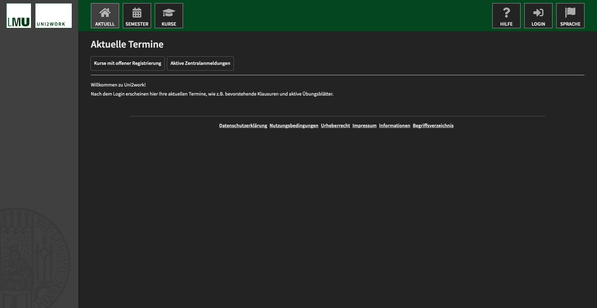

<h1 align="center">Uni2Work Dark</h1>

  A dark theme for the <a href="https://uni2work.ifi.lmu.de/">Uni2Work</a> system used at LMU Munich

  

  

## Installation

1. Install [Stylus](https://add0n.com/stylus.html) for [Firefox](https://addons.mozilla.org/firefox/addon/styl-us/), [Chrome](https://chrome.google.com/webstore/detail/stylus/clngdbkpkpeebahjckkjfobafhncgmne), or [Opera](https://addons.opera.com/extensions/details/stylus/).
2. Install the usercss by clicking [here](https://raw.githubusercontent.com/lx4r/uni2work-dark/master/uni2work-dark.user.css) (supports automatic updates, although those are unlikely to happen to be honest).

## Contributing

Found something that looks ugly or could be improved? Feel free to create an issue or better yet, submit an pull request! :)

## Credits

Some of the colors in this theme are from the [dark-gitlab](https://gitlab.com/vednoc/dark-gitlab) theme by vednoc.
